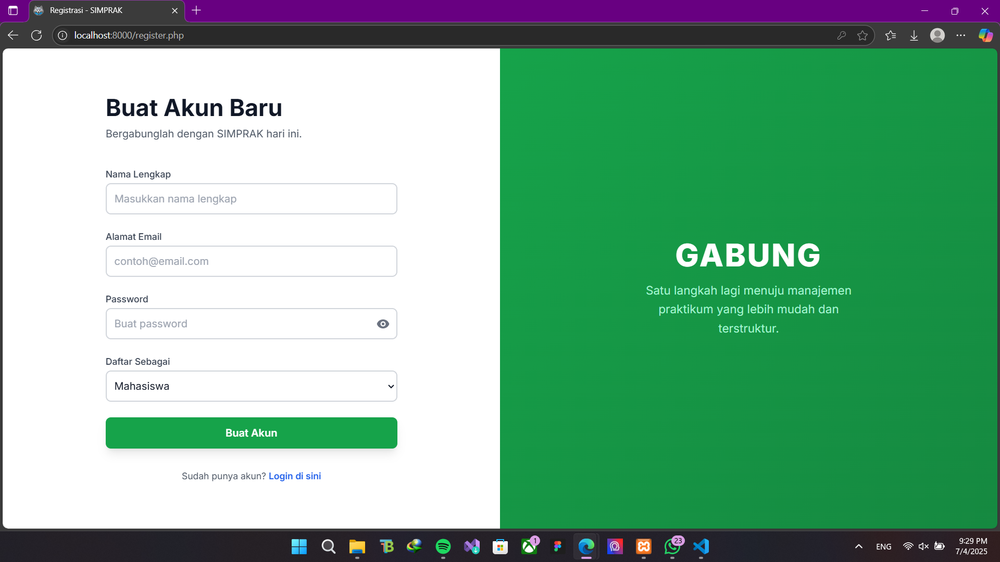
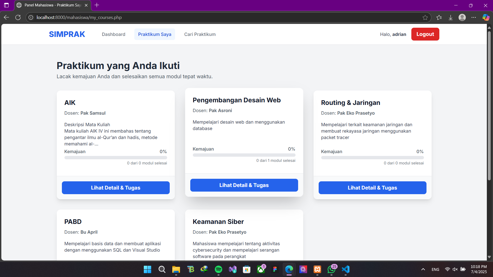
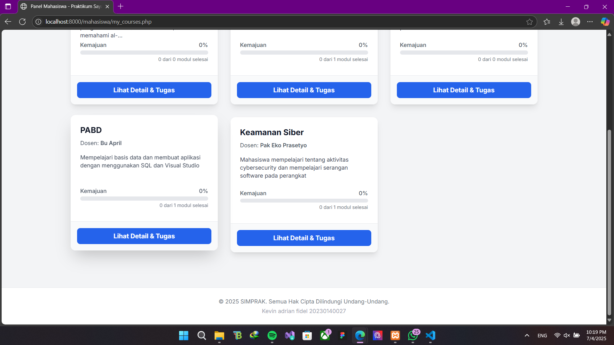

HALAMAN LOGIN

HALAMAN REGISTER

ASISTEN :

1. DASHBOARD

2. Manajemen Prak

3. Manajemen Modul

4. Laporan Masuk

5. Manajemen akun

MAHASISWA :

1. Dashboard

2. Praktikum Yang diikuti

3. Cari Praktikum

